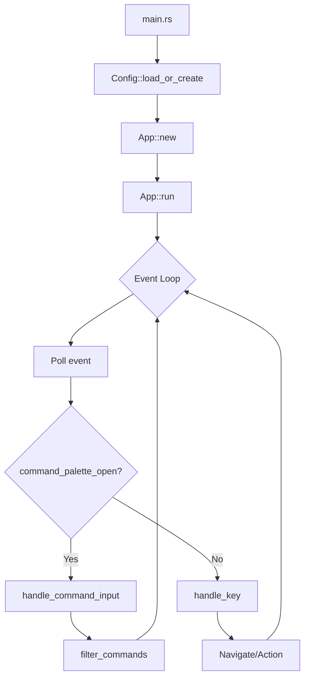
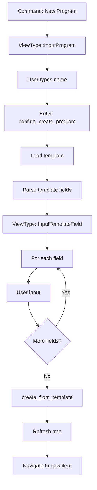

# Chronicle

## Overview

Chronicle is a Markdown-native planner and journal with a terminal UI (TUI). It uses a hierarchical folder structure (`programs/ → projects/ → milestones/ → tasks/`) plus `journal/` and `planning/` for daily notes and planning cycles.

## Architecture

### Current Module Map

```
src/
├── main.rs           # Entry point, calls tui::App::new().run()
├── config.rs         # Config loading from ~/.config/chronicle/config.toml
├── model/
│   └── mod.rs        # Task struct (minimal)
├── storage/
│   ├── mod.rs        # JournalStorage, WorkspaceStorage traits + impls
│   └── md.rs         # Markdown parsing utilities
├── commands/
│   ├── mod.rs        # CLI command exports
│   ├── init.rs       # `chronicle init` - create workspace
│   ├── new_task.rs   # `chronicle new` - CLI task creation
│   ├── jot.rs        # `chronicle jot` - quick journal entry
│   └── extract.rs    # `chronicle extract` - extract content
└── tui/
    ├── mod.rs        # App struct (MONOLITHIC - 1580 lines)
    ├── command.rs    # EMPTY STUB
    ├── navigation.rs # EMPTY STUB
    ├── layout.rs     # Rendering layout
    └── views/
        └── mod.rs    # View rendering
```

### Key Types

| Type | Location | Purpose |
|------|----------|---------|
| `App` | tui/mod.rs | Main TUI application state and event loop |
| `ViewType` | tui/mod.rs | Enum of all views (TreeView, Journal, Input*, etc.) |
| `CommandMatch` | tui/mod.rs | Command palette item with label, view, action |
| `CommandAction` | tui/mod.rs | Actions commands can trigger |
| `Config` | config.rs | User configuration |
| `Task` | model/mod.rs | Minimal task data structure |
| `SidebarItem` | tui/mod.rs | Tree view item for sidebar |

## Current Implementation Status

### ✅ Working Features

- **Command Palette**: `/` opens, typing filters, Up/Down navigates, Enter executes
- **Navigation**: Arrow keys work, tree expansion, hierarchy traversal
- **Element Creation**: Template-based wizard for Programs/Projects/Milestones/Tasks
- **Journal**: Open today's journal, browse history
- **Tree View**: Programs → Projects → Milestones → Tasks hierarchy
- **External Editor**: Launches configured editor, restores TUI after

### ⚠️ Needs Improvement

- **Monolithic App**: 1580 lines in single file, hard to maintain
- **Empty Modules**: `command.rs` and `navigation.rs` are stubs
- **Implicit Modes**: Uses `command_palette_open` bool + `ViewType` instead of explicit Mode enum
- **Minimal Domain Model**: Only Task struct, no Program/Project/Milestone types
- **No Archive**: Design calls for `.archive/` but not implemented

### ❌ Missing

- **Layered Error Types**: Uses anyhow everywhere, no thiserror types
- **Status/Assignee Commands**: No way to modify existing elements
- **Fuzzy Search**: Substring match only
- **Markdown Rendering**: Content shown as raw text

## Module Contracts

### config.rs

```rust
pub struct Config {
    pub data_path: PathBuf,      // Workspace directory
    pub editor: String,          // Editor command
    pub workflow: Vec<String>,   // Status workflow (e.g., ["todo", "doing", "done"])
}

impl Config {
    pub fn load_or_create() -> Result<Self>;
    pub fn config_path() -> Option<PathBuf>;
}
```

### storage/mod.rs

```rust
pub trait JournalStorage {
    fn journal_dir(&self) -> PathBuf;
    fn open_or_create_today_journal(&self) -> Result<(PathBuf, String)>;
    fn list_journal_entries(&self) -> Result<Vec<JournalEntry>>;
}

pub trait WorkspaceStorage {
    fn programs_dir(&self) -> PathBuf;
    fn list_programs(&self) -> Result<Vec<DirectoryEntry>>;
    fn list_projects(&self, program: &str) -> Result<Vec<DirectoryEntry>>;
    fn list_milestones(&self, program: &str, project: &str) -> Result<Vec<DirectoryEntry>>;
    fn list_tasks(&self, program: &str, project: &str, milestone: &str) -> Result<Vec<DirectoryEntry>>;
    fn create_from_template(&self, template_name: &str, target: &Path, values: &HashMap<String, String>, strip_labels: &HashSet<String>) -> Result<()>;
}

pub fn parse_template_fields(template: &str) -> Vec<(String, String, bool)>;
```

### tui/mod.rs (Current - needs refactoring)

```rust
pub struct App {
    // Configuration
    pub config: Config,
    
    // View state
    pub current_view: ViewType,
    pub command_palette_open: bool,  // Should become Mode enum
    
    // Navigation
    pub tree_state: TreeState,
    pub sidebar_items: Vec<SidebarItem>,
    pub selected_entry_index: usize,
    
    // Command palette
    pub command_input: String,
    pub command_matches: Vec<CommandMatch>,
    pub command_selection_index: usize,
    
    // Data
    pub programs: Vec<DirectoryEntry>,
    pub projects: Vec<DirectoryEntry>,
    pub milestones: Vec<DirectoryEntry>,
    pub tasks: Vec<DirectoryEntry>,
    pub journal_entries: Vec<JournalEntry>,
    
    // Input handling
    pub input_buffer: String,
    pub template_field_state: Option<TemplateFieldState>,
    
    // Content viewing
    pub selected_content: Option<DirectoryEntry>,
    pub current_content_text: Option<String>,
    
    // Lifecycle
    pub should_exit: bool,
    pub needs_terminal_reinit: bool,
}
```

## Data Flow

### Application Startup



### Element Creation Flow



## Key Decisions

### 2026-03-03: Sprint Planning Assessment

**Finding**: The original sprint plan ("App Modes & Command Palette") was based on outdated analysis. The command palette is already fully implemented.

**Decision**: Revised sprint to focus on:
1. Refactoring the monolithic `tui/mod.rs` (1580 lines)
2. Adding explicit `Mode` enum for cleaner state management
3. Populating the empty `command.rs` and `navigation.rs` modules

**Rationale**: The codebase is functional but unmaintainable in its current structure. Before adding new features, we need to organize the existing code.

## Current Sprint

**Branch**: `feat/app-modes`

### Goal

Refactor the monolithic App into maintainable modules with explicit Mode enum.

### Strategy: Incremental Refactoring

Each phase is a **single implementer task**. A phase is complete when:
- `cargo check` passes
- `cargo test` passes  
- `cargo run` still works (manual smoke test by architect)

**Do not proceed to the next phase until the current phase is verified.**

---

### Phase 1: Add Mode Enum (Additive Only)

**Goal**: Introduce the Mode enum without breaking anything.

**Changes** (in `src/tui/mod.rs` only):
1. Add `pub enum Mode { Normal, CommandPalette, Input }` near the top of the file, after imports
2. Add `mode: Mode` field to `App` struct (keep `command_palette_open: bool` for now)
3. In `App::new()`, initialize `mode: Mode::Normal`
4. **Do NOT** change any conditionals or remove anything

**Verification**:
```bash
cargo check   # Must compile
cargo test    # All tests pass
```

This is purely additive. Zero risk.

---

### Phase 2: Dual-Track Mode Setting (Transitional)

**Goal**: Start setting the mode alongside the existing bool.

**Changes** (in `src/tui/mod.rs` only):
1. Find every place where `command_palette_open = true` is set
2. Add `self.mode = Mode::CommandPalette;` on the next line
3. Find every place where `command_palette_open = false` is set
4. Add `self.mode = Mode::Normal;` on the next line
5. **Do NOT** change any conditionals yet

**Verification**:
```bash
cargo check   # Must compile
cargo test    # All tests pass
```

---

### Phase 3: Switch Conditionals to Mode

**Goal**: Use the mode in conditionals instead of the bool.

**Changes** (in `src/tui/mod.rs` only):
1. Replace `if self.command_palette_open` with `matches!(self.mode, Mode::CommandPalette)`
2. Replace `if !self.command_palette_open` with `!matches!(self.mode, Mode::CommandPalette)`
3. Keep the `command_palette_open` field for now (safety net)

**Verification**:
```bash
cargo check   # Must compile
cargo test    # All tests pass
cargo run     # Command palette must still work
```

---

### Phase 4: Remove command_palette_open Field

**Goal**: Complete the transition to Mode.

**Changes** (in `src/tui/mod.rs` only):
1. Delete the `command_palette_open: bool` field from `App` struct
2. Delete all lines that set `command_palette_open = true/false`
3. Run `cargo clippy --fix` to clean up any unused imports

**Verification**:
```bash
cargo check   # Must compile
cargo test    # All tests pass
cargo run     # Everything still works
```

---

### Phase 5: Create CommandPalette Struct (In Place)

**Goal**: Encapsulate command palette state without extracting to new file yet.

**Changes** (in `src/tui/mod.rs` only):
1. Create `pub struct CommandPalette` with fields:
   - `input: String`
   - `matches: Vec<CommandMatch>`
   - `selection_index: usize`
2. Add `impl CommandPalette` with:
   - `fn new() -> Self`
   - `fn is_empty(&self) -> bool`
   - `fn clear(&mut self)`
3. Add `command_palette: CommandPalette` field to `App`
4. In `App::new()`, initialize it
5. Update references: `self.command_input` → `self.command_palette.input`, etc.

**Verification**:
```bash
cargo check   # Must compile
cargo test    # All tests pass
```

---

### Phase 6: Move CommandPalette to command.rs

**Goal**: Extract the struct to its module.

**Changes**:
1. Move `CommandMatch`, `CommandAction`, `CommandPalette` from `mod.rs` to `command.rs`
2. Add `use crate::tui::command::{CommandPalette, CommandMatch, CommandAction};` in `mod.rs`
3. Ensure `command.rs` has necessary imports

**Verification**:
```bash
cargo check   # Must compile
cargo test    # All tests pass
```

---

### Phase 7-9: Navigation Extraction (Similar Pattern)

Following the same incremental approach:
- Phase 7: Create TreeNavigation struct in mod.rs
- Phase 8: Update App to use it
- Phase 9: Move to navigation.rs

---

### Phase 10: Add Mode Transition Tests

**Goal**: Verify mode transitions with unit tests.

**Changes** (add `#[cfg(test)]` block to `tui/mod.rs`):
```rust
#[cfg(test)]
mod tests {
    use super::*;
    
    #[test]
    fn test_slash_enters_command_palette_mode() {
        // Create app, send '/' key, assert mode is CommandPalette
    }
    
    #[test]
    fn test_esc_exits_command_palette_mode() {
        // Create app with CommandPalette mode, send Esc, assert Normal
    }
}
```

---

### Phase 11: Final Cleanup

- Run `cargo clippy -- -D warnings` and fix all issues
- Remove any `#[allow(dead_code)]` that are no longer needed
- Final `cargo test` and `cargo run` verification

---

### Current Status

| Phase | Status |
|-------|--------|
| Phase 1: Add Mode Enum | ✅ Complete |
| Phase 2: Dual-Track | ✅ Complete |
| Phase 3: Switch Conditionals | ✅ Complete |
| Phase 4: Remove Bool | ✅ Complete |
| Phase 5: CommandPalette Struct | ✅ Complete (skipped - went straight to Phase 6) |
| Phase 6: Extract to command.rs | ✅ Complete |
| Phase 7-9: Navigation | ✅ Complete |
| Phase 10: Tests | ✅ Complete |
| Phase 11: Cleanup | ✅ Complete |

**Sprint Complete!** All phases finished. Ready for merge.

## Open Questions

1. **Domain Model Expansion**: Should we add proper `Program`, `Project`, `Milestone` structs to `model/mod.rs`, or keep the current approach of treating everything as `DirectoryEntry`?

2. **Error Type Migration**: Should we migrate from `anyhow` to layered `thiserror` types in this sprint, or defer to a future sprint?

3. **Async Runtime**: Tokio is a dependency but not used. Should we remove it or plan for async operations (e.g., file watching)?

## Changelog

| Date | Event |
|------|-------|
| 2026-03-03 | Created DESIGN.md with actual codebase assessment |
| 2026-03-03 | Created branch `feat/app-modes` |
| 2026-03-03 | Tagged `stable/pre-app-modes-2026-03-03` |
| 2026-03-03 | Committed AGENTS.md improvements |
