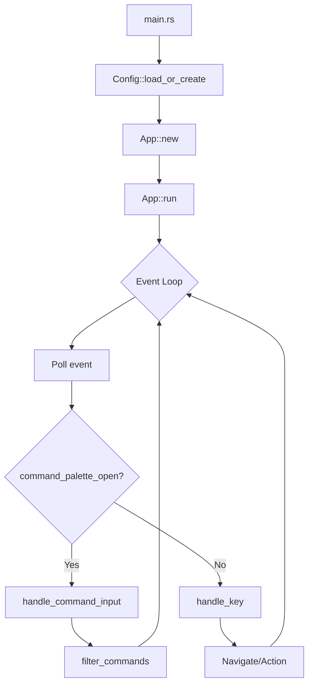
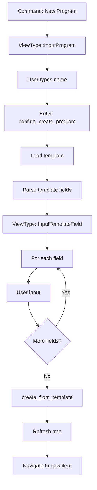

# Chronicle

## Overview

Chronicle is a Markdown-native planner and journal with a terminal UI (TUI). It uses a hierarchical folder structure (`programs/ → projects/ → milestones/ → tasks/`) plus `journal/` and `planning/` for daily notes and planning cycles.

## Architecture

### Current Module Map

```
src/
├── main.rs           # Entry point, calls tui::App::new().run()
├── config.rs         # Config loading from ~/.config/chronicle/config.toml
├── model/
│   └── mod.rs        # Task struct (minimal)
├── storage/
│   ├── mod.rs        # JournalStorage, WorkspaceStorage traits + impls
│   └── md.rs         # Markdown parsing utilities
├── commands/
│   ├── mod.rs        # CLI command exports
│   ├── init.rs       # `chronicle init` - create workspace
│   ├── new_task.rs   # `chronicle new` - CLI task creation
│   ├── jot.rs        # `chronicle jot` - quick journal entry
│   └── extract.rs    # `chronicle extract` - extract content
└── tui/
    ├── mod.rs        # App struct (MONOLITHIC - 1580 lines)
    ├── command.rs    # EMPTY STUB
    ├── navigation.rs # EMPTY STUB
    ├── layout.rs     # Rendering layout
    └── views/
        └── mod.rs    # View rendering
```

### Key Types

| Type | Location | Purpose |
|------|----------|---------|
| `App` | tui/mod.rs | Main TUI application state and event loop |
| `ViewType` | tui/mod.rs | Enum of all views (TreeView, Journal, Input*, etc.) |
| `CommandMatch` | tui/mod.rs | Command palette item with label, view, action |
| `CommandAction` | tui/mod.rs | Actions commands can trigger |
| `Config` | config.rs | User configuration |
| `Task` | model/mod.rs | Minimal task data structure |
| `SidebarItem` | tui/mod.rs | Tree view item for sidebar |

## Current Implementation Status

### ✅ Working Features

- **Command Palette**: `/` opens, typing filters, Up/Down navigates, Enter executes
- **Navigation**: Arrow keys work, tree expansion, hierarchy traversal
- **Element Creation**: Template-based wizard for Programs/Projects/Milestones/Tasks
- **Journal**: Open today's journal, browse history
- **Tree View**: Programs → Projects → Milestones → Tasks hierarchy
- **External Editor**: Launches configured editor, restores TUI after

### ⚠️ Needs Improvement

- **Monolithic App**: 1580 lines in single file, hard to maintain
- **Empty Modules**: `command.rs` and `navigation.rs` are stubs
- **Implicit Modes**: Uses `command_palette_open` bool + `ViewType` instead of explicit Mode enum
- **Minimal Domain Model**: Only Task struct, no Program/Project/Milestone types
- **No Archive**: Design calls for `.archive/` but not implemented

### ❌ Missing

- **Layered Error Types**: Uses anyhow everywhere, no thiserror types
- **Status/Assignee Commands**: No way to modify existing elements
- **Fuzzy Search**: Substring match only
- **Markdown Rendering**: Content shown as raw text

## Module Contracts

### config.rs

```rust
pub struct Config {
    pub data_path: PathBuf,      // Workspace directory
    pub editor: String,          // Editor command
    pub workflow: Vec<String>,   // Status workflow (e.g., ["todo", "doing", "done"])
}

impl Config {
    pub fn load_or_create() -> Result<Self>;
    pub fn config_path() -> Option<PathBuf>;
}
```

### storage/mod.rs

```rust
pub trait JournalStorage {
    fn journal_dir(&self) -> PathBuf;
    fn open_or_create_today_journal(&self) -> Result<(PathBuf, String)>;
    fn list_journal_entries(&self) -> Result<Vec<JournalEntry>>;
}

pub trait WorkspaceStorage {
    fn programs_dir(&self) -> PathBuf;
    fn list_programs(&self) -> Result<Vec<DirectoryEntry>>;
    fn list_projects(&self, program: &str) -> Result<Vec<DirectoryEntry>>;
    fn list_milestones(&self, program: &str, project: &str) -> Result<Vec<DirectoryEntry>>;
    fn list_tasks(&self, program: &str, project: &str, milestone: &str) -> Result<Vec<DirectoryEntry>>;
    fn create_from_template(&self, template_name: &str, target: &Path, values: &HashMap<String, String>, strip_labels: &HashSet<String>) -> Result<()>;
}

pub fn parse_template_fields(template: &str) -> Vec<(String, String, bool)>;
```

### tui/mod.rs (Current - needs refactoring)

```rust
pub struct App {
    // Configuration
    pub config: Config,
    
    // View state
    pub current_view: ViewType,
    pub command_palette_open: bool,  // Should become Mode enum
    
    // Navigation
    pub tree_state: TreeState,
    pub sidebar_items: Vec<SidebarItem>,
    pub selected_entry_index: usize,
    
    // Command palette
    pub command_input: String,
    pub command_matches: Vec<CommandMatch>,
    pub command_selection_index: usize,
    
    // Data
    pub programs: Vec<DirectoryEntry>,
    pub projects: Vec<DirectoryEntry>,
    pub milestones: Vec<DirectoryEntry>,
    pub tasks: Vec<DirectoryEntry>,
    pub journal_entries: Vec<JournalEntry>,
    
    // Input handling
    pub input_buffer: String,
    pub template_field_state: Option<TemplateFieldState>,
    
    // Content viewing
    pub selected_content: Option<DirectoryEntry>,
    pub current_content_text: Option<String>,
    
    // Lifecycle
    pub should_exit: bool,
    pub needs_terminal_reinit: bool,
}
```

## Data Flow

### Application Startup



### Element Creation Flow



## Key Decisions

### 2026-03-03: Sprint Planning Assessment

**Finding**: The original sprint plan ("App Modes & Command Palette") was based on outdated analysis. The command palette is already fully implemented.

**Decision**: Revised sprint to focus on:
1. Refactoring the monolithic `tui/mod.rs` (1580 lines)
2. Adding explicit `Mode` enum for cleaner state management
3. Populating the empty `command.rs` and `navigation.rs` modules

**Rationale**: The codebase is functional but unmaintainable in its current structure. Before adding new features, we need to organize the existing code.

## Current Sprint

**Branch**: `fix/config-toml-parsing`

### Goal

Fix the config system to properly parse TOML files and include all expected fields.

### Problem

The `Config` struct in `src/config.rs` has three issues:

1. **Wrong parser**: Uses `serde_yaml::from_str()` to parse a `.toml` file (line 51)
2. **Missing fields**: Config file has `workspace`, `navigator_width`, `planning_duration`, `navigation_keys` but struct only has `version`, `data_path`, `editor`, `workflow`
3. **Field name mismatch**: Config file uses `workspace` but struct uses `data_path`

### Tasks

- [ ] **T1: Add toml dependency** to `Cargo.toml` (already present, just verify)
- [ ] **T2: Fix Config struct** to include all fields from the config file format
- [ ] **T3: Replace YAML parser with TOML parser** in `load_or_create()` and `prompt_first_run()`
- [ ] **T4: Update tests** to ensure config parsing works
- [ ] **T5: Verify** with `cargo run` that existing config loads correctly

### Target Config Structure

```toml
workspace = "/home/user/chronicle"
editor = "helix"
navigator_width = 60
planning_duration = "biweekly"

workflow = ["New", "Active", "Blocked", "Testing", "Completed", "Cancelled"]

[navigation_keys]
left = "h"
right = "l"
up = "k"
down = "j"
```

### Verification

```bash
cargo test    # All tests pass
cargo run     # Config loads without error
```

---

### Previous Sprint (Completed)

**Branch**: `feat/app-modes` — **MERGED** (tag: `stable/app-modes-2026-03-03`)

All phases completed: Mode enum, CommandPalette extraction, Navigation extraction, tests, cleanup.

## Open Questions

1. **Domain Model Expansion**: Should we add proper `Program`, `Project`, `Milestone` structs to `model/mod.rs`, or keep the current approach of treating everything as `DirectoryEntry`?

2. **Error Type Migration**: Should we migrate from `anyhow` to layered `thiserror` types in this sprint, or defer to a future sprint?

3. **Async Runtime**: Tokio is a dependency but not used. Should we remove it or plan for async operations (e.g., file watching)?

## Changelog

| Date | Event |
|------|-------|
| 2026-03-03 | Created DESIGN.md with actual codebase assessment |
| 2026-03-03 | Created branch `feat/app-modes` |
| 2026-03-03 | Tagged `stable/pre-app-modes-2026-03-03` |
| 2026-03-03 | Committed AGENTS.md improvements |
