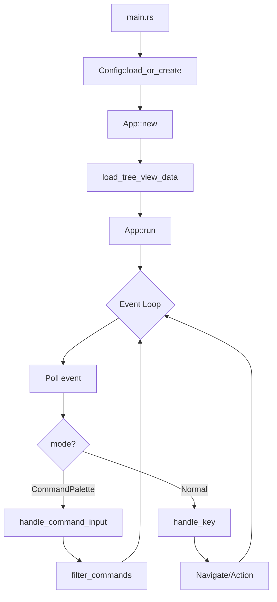
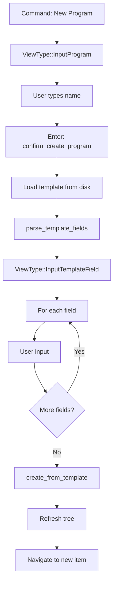

# Chronicle

## Overview

Chronicle is a Markdown-native planner and journal with a terminal UI (TUI). It uses a hierarchical folder structure (`programs/ → projects/ → milestones/ → tasks/`) plus `journal/` and `planning/` for daily notes and planning cycles.

## Architecture

### Current Module Map

```
src/
├── main.rs           # Entry point: config::Config::load_or_create() → tui::App::new().run()
├── config.rs         # Config loading from ~/.config/chronicle/config.toml
├── model/
│   └── mod.rs        # Task struct, ParseError (minimal domain model)
├── storage/
│   ├── mod.rs        # JournalStorage, WorkspaceStorage traits + impls
│   └── md.rs         # parse_task(), task_to_markdown() (not wired up)
├── commands/
│   ├── mod.rs        # CLI command exports
│   ├── init.rs       # `chronicle init` - create workspace
│   ├── new_task.rs   # `chronicle new` - CLI task creation
│   ├── jot.rs        # `chronicle jot` - quick journal entry
│   └── extract.rs    # `chronicle extract` - extract content
└── tui/
    ├── mod.rs        # App struct (MONOLITHIC - 1430+ lines)
    ├── command.rs    # CommandPalette, CommandMatch, CommandAction (NOT WIRED UP)
    ├── navigation.rs # SidebarItem, TreeState, navigation helpers (NOT WIRED UP)
    ├── layout.rs     # Rendering functions (all views)
    └── views/
        └── mod.rs    # Placeholder comment only
```

### Key Types

| Type | Location | Purpose |
|------|----------|---------|
| `App` | tui/mod.rs | Main TUI application state and event loop |
| `Mode` | tui/mod.rs | Interaction mode enum (Normal, CommandPalette, Input) |
| `ViewType` | tui/mod.rs | Enum of all views (TreeView, Journal, Input*, etc.) |
| `CommandMatch` | tui/mod.rs | Command palette item with label, view, action |
| `CommandAction` | tui/mod.rs | Actions commands can trigger |
| `Config` | config.rs | User configuration (workspace, editor, workflow, keys) |
| `Task` | model/mod.rs | Task data structure (title, status, priority, etc.) |
| `SidebarItem` | tui/mod.rs | Tree view item for sidebar |
| `DirectoryEntry` | storage/mod.rs | File system entry with name, path, is_dir |
| `JournalEntry` | storage/mod.rs | Journal file entry |

## Current Implementation Status

### ✅ Working Features

- **Command Palette**: `/` opens, typing filters, Up/Down navigates, Enter executes
- **Navigation**: Arrow keys work, tree expansion, hierarchy traversal (4 levels deep)
- **Element Creation**: Template-based wizard for Programs/Projects/Milestones/Tasks
- **Journal**: Open today's journal, browse history
- **Tree View**: Programs → Projects → Milestones → Tasks → Subtasks hierarchy
- **External Editor**: Launches configured editor, restores TUI after
- **Mode Enum**: Proper `Mode` enum exists (Normal, CommandPalette, Input)

### ⚠️ Needs Improvement

- **Monolithic App**: 1430+ lines in `tui/mod.rs`, hard to maintain
- **Duplicate Types**: `command.rs` and `navigation.rs` have full implementations but are NOT WIRED UP
  - `tui/mod.rs` defines its own inline `SidebarItem`, `TreeState`, `CommandMatch`, `CommandAction`
  - Extracted modules have `#[allow(dead_code)]` on everything
- **Template Wizard Inline**: All template field handling is in App, not extracted
- **Minimal Domain Model**: Only Task struct, no Program/Project/Milestone types
- **No Archive**: Design calls for `.archive/` but not implemented

### ❌ Missing

- **Layered Error Types**: Uses anyhow everywhere, no thiserror types
- **Status/Assignee Commands**: No way to modify existing elements
- **Fuzzy Search**: Substring match only
- **Markdown Rendering**: Content shown as raw text
- **views/mod.rs**: Only contains placeholder comment

## Module Contracts

### config.rs

```rust
pub struct NavigationKeys {
    pub left: char,   // default 'h'
    pub right: char,  // default 'l'
    pub up: char,     // default 'k'
    pub down: char,   // default 'j'
}

pub struct Config {
    pub workspace: PathBuf,           // Workspace directory
    pub editor: String,               // Editor command (default "hx")
    pub workflow: Vec<String>,        // Status workflow
    pub navigator_width: u16,         // Sidebar width (default 60)
    pub planning_duration: String,    // "biweekly"
    pub navigation_keys: NavigationKeys,
}

impl Config {
    pub fn load_or_create() -> Result<Self>;
    pub fn config_path() -> Option<PathBuf>;
    pub fn config_dir() -> Option<PathBuf>;
}
```

### storage/mod.rs

```rust
pub struct DirectoryEntry {
    pub name: String,
    pub path: PathBuf,
    pub is_dir: bool,
}

pub struct JournalEntry {
    pub filename: String,
    pub path: PathBuf,
}

pub trait JournalStorage {
    fn journal_dir(&self) -> PathBuf;
    fn open_or_create_today_journal(&self) -> Result<(PathBuf, String)>;
    fn list_journal_entries(&self) -> Result<Vec<JournalEntry>>;
}

pub trait WorkspaceStorage {
    fn programs_dir(&self) -> PathBuf;
    fn list_programs(&self) -> Result<Vec<DirectoryEntry>>;
    fn list_projects(&self, program: &str) -> Result<Vec<DirectoryEntry>>;
    fn list_milestones(&self, program: &str, project: &str) -> Result<Vec<DirectoryEntry>>;
    fn list_tasks(&self, program: &str, project: &str, milestone: &str) -> Result<Vec<DirectoryEntry>>;
    fn list_subtasks(&self, program: &str, project: &str, milestone: &str, task: &str) -> Result<Vec<DirectoryEntry>>;
    fn create_from_template(&self, template_name: &str, target: &Path, values: &HashMap<String, String>, strip_labels: &HashSet<String>) -> Result<PathBuf>;
}

pub fn parse_template_fields(template: &str) -> Vec<(String, String, bool)>;
pub fn resolve_template(template: &str, values: &HashMap<String, String>, strip_labels: &HashSet<String>) -> String;
```

### tui/mod.rs (Current - needs refactoring)

```rust
pub enum Mode {
    Normal,
    CommandPalette,
    Input,  // TODO: Will be used for input mode
}

pub enum ViewType {
    TreeView,
    Journal,
    JournalArchiveList,
    JournalToday,       // TODO
    Backlog,
    WeeklyPlanning,
    ViewingContent,
    InputProgram,
    InputProject,
    InputMilestone,
    InputTask,
    InputTemplateField,
}

pub struct App {
    // Configuration
    pub config: Config,
    
    // View state
    pub current_view: ViewType,
    pub mode: Mode,  // Good: proper enum exists
    
    // Navigation (duplicates types in navigation.rs)
    pub tree_state: TreeState,
    pub sidebar_items: Vec<SidebarItem>,
    pub selected_entry_index: usize,
    pub current_program: Option<String>,
    pub current_project: Option<String>,
    pub current_milestone: Option<String>,
    pub current_task: Option<String>,
    
    // Command palette (duplicates types in command.rs)
    pub command_input: String,
    pub command_matches: Vec<CommandMatch>,
    pub command_selection_index: usize,
    
    // Data
    pub programs: Vec<DirectoryEntry>,
    pub projects: Vec<DirectoryEntry>,
    pub milestones: Vec<DirectoryEntry>,
    pub tasks: Vec<DirectoryEntry>,
    pub subtasks: Vec<DirectoryEntry>,
    pub journal_entries: Vec<JournalEntry>,
    
    // Input handling
    pub input_buffer: String,
    pub template_field_state: Option<TemplateFieldState>,
    
    // Content viewing
    pub selected_content: Option<DirectoryEntry>,
    pub current_content_text: Option<String>,
    
    // Lifecycle
    pub should_exit: bool,
    pub needs_terminal_reinit: bool,
}
```

### tui/command.rs (NOT WIRED UP - all #[allow(dead_code)])

```rust
pub struct CommandPalette {
    pub input: String,
    pub matches: Vec<CommandMatch>,
    pub selection_index: usize,
}

impl CommandPalette {
    pub fn new() -> Self;
    pub fn handle_input(&mut self, code: KeyCode) -> Option<CommandMatch>;
    pub fn open(&mut self);
    pub fn close(&mut self);
}

pub fn get_command_list() -> Vec<CommandMatch>;
pub fn filter_commands(input: &str, depth: usize) -> Vec<CommandMatch>;
```

### tui/navigation.rs (NOT WIRED UP - all #[allow(dead_code)])

```rust
pub struct TreeState {
    pub path: Vec<String>,
    pub expanded: Vec<String>,
}

impl TreeState {
    pub fn depth(&self) -> usize;
    pub fn is_root(&self) -> bool;
    pub fn push(&mut self, name: impl Into<String>);
    pub fn pop(&mut self) -> Option<String>;
}

pub fn build_sidebar_items(...) -> Vec<SidebarItem>;
pub fn navigate_up(items: &[SidebarItem], current_index: usize) -> usize;
pub fn navigate_down(items: &[SidebarItem], current_index: usize) -> usize;
```

## Data Flow

### Application Startup



### Element Creation Flow



## Key Decisions

### 2026-03-03: Sprint Planning Assessment

**Finding**: The original sprint plan ("App Modes & Command Palette") was based on outdated analysis. The command palette is already fully implemented.

**Decision**: Revised sprint to focus on:
1. Refactoring the monolithic `tui/mod.rs` (1430+ lines)
2. Wiring up the extracted `command.rs` and `navigation.rs` modules
3. Removing duplicate type definitions

**Rationale**: The codebase is functional but has significant duplication. The extracted modules exist but are not used.

### 2026-03-04: Architecture Assessment

**Finding**: The `command.rs` and `navigation.rs` modules are NOT empty stubs - they contain complete implementations with tests. However, they are marked `#[allow(dead_code)]` and the `App` struct defines duplicate types inline.

**Next Steps**:
1. Wire up `CommandPalette` from `command.rs` to replace inline command handling in App
2. Wire up `TreeState` and navigation functions from `navigation.rs`
3. Remove duplicate type definitions from `tui/mod.rs`

## Current Sprint

**Branch**: `refactor/wire-extracted-modules`
**Tag**: `stable/pre-wire-up-2026-03-04`
**Goal**: Wire up extracted `command.rs` and `navigation.rs` modules to eliminate code duplication.

### Problem

The `command.rs` and `navigation.rs` modules contain complete implementations with passing tests, but they are marked `#[allow(dead_code)]` and never imported. The `App` struct in `tui/mod.rs` contains duplicate implementations of:
- `CommandPalette`, `CommandMatch`, `CommandAction` types
- `filter_commands()`, `get_command_list()` functions
- `TreeState`, `SidebarItem` types
- `build_sidebar_items()`, `navigate_up()`, `navigate_down()` functions

This is ~500 lines of duplicate code and two sources of truth for the same logic.

### Tasks

- [ ] **T1: Wire up `navigation.rs` types**
  - Replace inline `SidebarItem`, `SidebarSection`, `TreeState` in `tui/mod.rs` with imports from `navigation.rs`
  - Update `build_sidebar_items()` calls to use the module function
  - Update `navigate_up()`/`navigate_down()` calls
  - Remove duplicate type definitions from `tui/mod.rs`

- [ ] **T2: Wire up `command.rs` types**
  - Replace inline `CommandMatch`, `CommandAction` in `tui/mod.rs` with imports from `command.rs`
  - Replace `App::filter_commands()` with `command::filter_commands()`
  - Replace inline `get_command_list()` with `command::get_command_list()`
  - Remove duplicate type definitions from `tui/mod.rs`

- [ ] **T3: Remove dead code annotations**
  - Remove `#[allow(dead_code)]` from wired-up types in both modules
  - Ensure all public items are actually used

- [ ] **T4: Verify tests pass**
  - Run `cargo test` - all existing tests must pass
  - The extracted modules already have 18 tests between them

### Success Criteria

- `cargo test` passes with 0 failures
- `cargo clippy` passes with 0 warnings
- `tui/mod.rs` reduced by ~400-500 lines
- No `#[allow(dead_code)]` on wired types
- Single source of truth for command/navigation logic

---

### Recent Sprints (Completed)

**Branch**: `refactor/tree-navigation-dry` — **MERGED** (tag: `stable/tree-navigation-refactor-2026-03-03`)
- Fixed flat tasks discovery in `tasks/` subdirectory
- Added subtasks support (depth 4 navigation)
- Added `discover_elements()` helper to reduce code duplication
- Added tracing for error logging
- 49 tests passing

**Branch**: `fix/collapse-on-navigate-left` — **MERGED** (tag: `stable/navigate-left-fix-2026-03-03`)
- Navigate left now selects parent item instead of header

**Branch**: `fix/selection-on-navigate` — **MERGED** (tag: `stable/selection-fix-2026-03-03`)
- On initial load, first program is selected
- On navigate right, selection moves to first child item

**Branch**: `fix/storage-discovery` — **MERGED** (tag: `stable/storage-discovery-2026-03-03`)
- Fix storage discovery to handle both flat and nested element structures

**Branch**: `fix/config-toml-parsing` — **MERGED** (tag: `stable/config-toml-fix-2026-03-03`)
- Fixed TOML config parsing, added missing fields, renamed data_path to workspace

## Open Questions

1. **Domain Model Expansion**: Should we add proper `Program`, `Project`, `Milestone` structs to `model/mod.rs`, or keep the current approach of treating everything as `DirectoryEntry`?

2. **Error Type Migration**: Should we migrate from `anyhow` to layered `thiserror` types in this sprint, or defer to a future sprint?

3. **Async Runtime**: Tokio is a dependency but not used. Should we remove it or plan for async operations (e.g., file watching)?

4. **Module Wiring Strategy**: Should we wire up `command.rs` and `navigation.rs` in one sprint or split into two?

## Changelog

| Date | Event |
|------|-------|
| 2026-03-04 | Corrected architecture assessment - command.rs and navigation.rs are NOT empty |
| 2026-03-03 | Created DESIGN.md with actual codebase assessment |
| 2026-03-03 | Created branch `feat/app-modes` |
| 2026-03-03 | Tagged `stable/pre-app-modes-2026-03-03` |
| 2026-03-03 | Committed AGENTS.md improvements |
