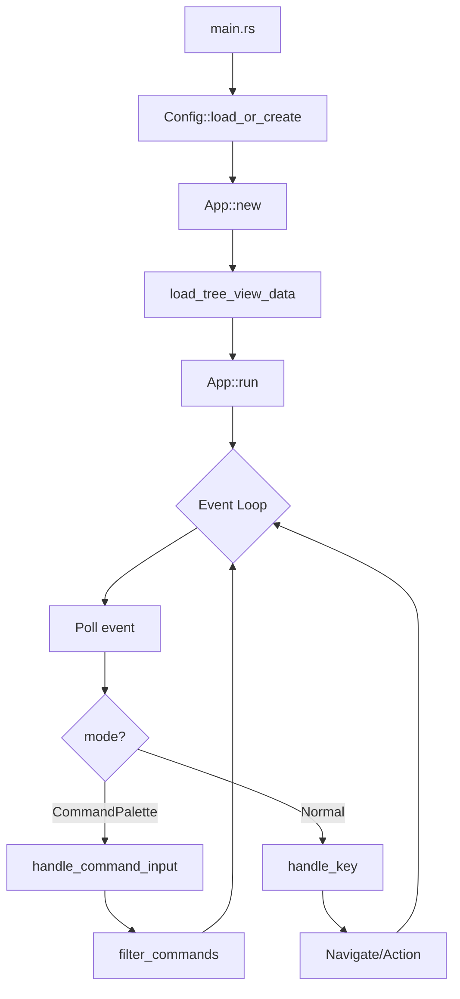
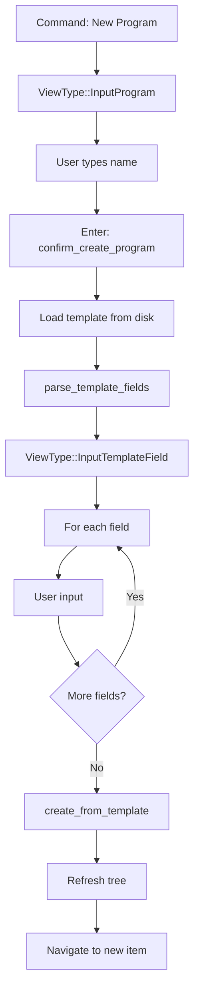

# Chronicle

## Overview

Chronicle is a Markdown-native planner and journal with a terminal UI (TUI). It uses a hierarchical folder structure (`programs/ → projects/ → milestones/ → tasks/`) plus `journal/` and `planning/` for daily notes and planning cycles.

## Architecture

### Current Module Map

```
src/
├── main.rs           # Entry point: config::Config::load_or_create() → tui::App::new().run()
├── config.rs         # Config loading from ~/.config/chronicle/config.toml
├── model/
│   └── mod.rs        # Task struct, ParseError (minimal domain model)
├── storage/
│   ├── mod.rs        # JournalStorage, WorkspaceStorage traits + impls
│   └── md.rs         # parse_task(), task_to_markdown() (not wired up)
├── commands/
│   ├── mod.rs        # CLI command exports
│   ├── init.rs       # `chronicle init` - create workspace
│   ├── new_task.rs   # `chronicle new` - CLI task creation
│   ├── jot.rs        # `chronicle jot` - quick journal entry
│   └── extract.rs    # `chronicle extract` - extract content
└── tui/
    ├── mod.rs        # App struct (MONOLITHIC - 1430+ lines)
    ├── command.rs    # CommandPalette, CommandMatch, CommandAction (NOT WIRED UP)
    ├── navigation.rs # SidebarItem, TreeState, navigation helpers (NOT WIRED UP)
    ├── layout.rs     # Rendering functions (all views)
    └── views/
        └── mod.rs    # Placeholder comment only
```

### Key Types

| Type | Location | Purpose |
|------|----------|---------|
| `App` | tui/mod.rs | Main TUI application state and event loop |
| `Mode` | tui/mod.rs | Interaction mode enum (Normal, CommandPalette, Input) |
| `ViewType` | tui/mod.rs | Enum of all views (TreeView, Journal, Input*, etc.) |
| `CommandMatch` | tui/mod.rs | Command palette item with label, view, action |
| `CommandAction` | tui/mod.rs | Actions commands can trigger |
| `Config` | config.rs | User configuration (workspace, editor, workflow, keys) |
| `Task` | model/mod.rs | Task data structure (title, status, priority, etc.) |
| `SidebarItem` | tui/mod.rs | Tree view item for sidebar |
| `DirectoryEntry` | storage/mod.rs | File system entry with name, path, is_dir |
| `JournalEntry` | storage/mod.rs | Journal file entry |

## Current Implementation Status

### ✅ Working Features

- **Command Palette**: `/` opens, typing filters, Up/Down navigates, Enter executes
- **Navigation**: Arrow keys work, tree expansion, hierarchy traversal (4 levels deep)
- **Element Creation**: Template-based wizard for Programs/Projects/Milestones/Tasks
- **Journal**: Open today's journal, browse history
- **Tree View**: Programs → Projects → Milestones → Tasks → Subtasks hierarchy
- **External Editor**: Launches configured editor, restores TUI after
- **Mode Enum**: Proper `Mode` enum exists (Normal, CommandPalette, Input)

### ⚠️ Needs Improvement

- **Monolithic App**: 1430+ lines in `tui/mod.rs`, hard to maintain
- **Duplicate Types**: `command.rs` and `navigation.rs` have full implementations but are NOT WIRED UP
  - `tui/mod.rs` defines its own inline `SidebarItem`, `TreeState`, `CommandMatch`, `CommandAction`
  - Extracted modules have `#[allow(dead_code)]` on everything
- **Template Wizard Inline**: All template field handling is in App, not extracted
- **Minimal Domain Model**: Only Task struct, no Program/Project/Milestone types
- **No Archive**: Design calls for `.archive/` but not implemented

### ❌ Missing

- **Layered Error Types**: Uses anyhow everywhere, no thiserror types
- **Status/Assignee Commands**: No way to modify existing elements
- **Fuzzy Search**: Substring match only
- **Markdown Rendering**: Content shown as raw text
- **views/mod.rs**: Only contains placeholder comment

## Module Contracts

### config.rs

```rust
pub struct NavigationKeys {
    pub left: char,   // default 'h'
    pub right: char,  // default 'l'
    pub up: char,     // default 'k'
    pub down: char,   // default 'j'
}

pub struct Config {
    pub workspace: PathBuf,           // Workspace directory
    pub editor: String,               // Editor command (default "hx")
    pub workflow: Vec<String>,        // Status workflow
    pub navigator_width: u16,         // Sidebar width (default 60)
    pub planning_duration: String,    // "biweekly"
    pub navigation_keys: NavigationKeys,
}

impl Config {
    pub fn load_or_create() -> Result<Self>;
    pub fn config_path() -> Option<PathBuf>;
    pub fn config_dir() -> Option<PathBuf>;
}
```

### storage/mod.rs

```rust
pub struct DirectoryEntry {
    pub name: String,
    pub path: PathBuf,
    pub is_dir: bool,
}

pub struct JournalEntry {
    pub filename: String,
    pub path: PathBuf,
}

pub trait JournalStorage {
    fn journal_dir(&self) -> PathBuf;
    fn open_or_create_today_journal(&self) -> Result<(PathBuf, String)>;
    fn list_journal_entries(&self) -> Result<Vec<JournalEntry>>;
}

pub trait WorkspaceStorage {
    fn programs_dir(&self) -> PathBuf;
    fn list_programs(&self) -> Result<Vec<DirectoryEntry>>;
    fn list_projects(&self, program: &str) -> Result<Vec<DirectoryEntry>>;
    fn list_milestones(&self, program: &str, project: &str) -> Result<Vec<DirectoryEntry>>;
    fn list_tasks(&self, program: &str, project: &str, milestone: &str) -> Result<Vec<DirectoryEntry>>;
    fn list_subtasks(&self, program: &str, project: &str, milestone: &str, task: &str) -> Result<Vec<DirectoryEntry>>;
    fn create_from_template(&self, template_name: &str, target: &Path, values: &HashMap<String, String>, strip_labels: &HashSet<String>) -> Result<PathBuf>;
}

pub fn parse_template_fields(template: &str) -> Vec<(String, String, bool)>;
pub fn resolve_template(template: &str, values: &HashMap<String, String>, strip_labels: &HashSet<String>) -> String;
```

### tui/mod.rs (Current - needs refactoring)

```rust
pub enum Mode {
    Normal,
    CommandPalette,
    Input,  // TODO: Will be used for input mode
}

pub enum ViewType {
    TreeView,
    Journal,
    JournalArchiveList,
    JournalToday,       // TODO
    Backlog,
    WeeklyPlanning,
    ViewingContent,
    InputProgram,
    InputProject,
    InputMilestone,
    InputTask,
    InputTemplateField,
}

pub struct App {
    // Configuration
    pub config: Config,
    
    // View state
    pub current_view: ViewType,
    pub mode: Mode,  // Good: proper enum exists
    
    // Navigation (duplicates types in navigation.rs)
    pub tree_state: TreeState,
    pub sidebar_items: Vec<SidebarItem>,
    pub selected_entry_index: usize,
    pub current_program: Option<String>,
    pub current_project: Option<String>,
    pub current_milestone: Option<String>,
    pub current_task: Option<String>,
    
    // Command palette (duplicates types in command.rs)
    pub command_input: String,
    pub command_matches: Vec<CommandMatch>,
    pub command_selection_index: usize,
    
    // Data
    pub programs: Vec<DirectoryEntry>,
    pub projects: Vec<DirectoryEntry>,
    pub milestones: Vec<DirectoryEntry>,
    pub tasks: Vec<DirectoryEntry>,
    pub subtasks: Vec<DirectoryEntry>,
    pub journal_entries: Vec<JournalEntry>,
    
    // Input handling
    pub input_buffer: String,
    pub template_field_state: Option<TemplateFieldState>,
    
    // Content viewing
    pub selected_content: Option<DirectoryEntry>,
    pub current_content_text: Option<String>,
    
    // Lifecycle
    pub should_exit: bool,
    pub needs_terminal_reinit: bool,
}
```

### tui/command.rs (NOT WIRED UP - all #[allow(dead_code)])

```rust
pub struct CommandPalette {
    pub input: String,
    pub matches: Vec<CommandMatch>,
    pub selection_index: usize,
}

impl CommandPalette {
    pub fn new() -> Self;
    pub fn handle_input(&mut self, code: KeyCode) -> Option<CommandMatch>;
    pub fn open(&mut self);
    pub fn close(&mut self);
}

pub fn get_command_list() -> Vec<CommandMatch>;
pub fn filter_commands(input: &str, depth: usize) -> Vec<CommandMatch>;
```

### tui/navigation.rs (NOT WIRED UP - all #[allow(dead_code)])

```rust
pub struct TreeState {
    pub path: Vec<String>,
    pub expanded: Vec<String>,
}

impl TreeState {
    pub fn depth(&self) -> usize;
    pub fn is_root(&self) -> bool;
    pub fn push(&mut self, name: impl Into<String>);
    pub fn pop(&mut self) -> Option<String>;
}

pub fn build_sidebar_items(...) -> Vec<SidebarItem>;
pub fn navigate_up(items: &[SidebarItem], current_index: usize) -> usize;
pub fn navigate_down(items: &[SidebarItem], current_index: usize) -> usize;
```

## Data Flow

### Application Startup



### Element Creation Flow



## Key Decisions

### 2026-03-03: Sprint Planning Assessment

**Finding**: The original sprint plan ("App Modes & Command Palette") was based on outdated analysis. The command palette is already fully implemented.

**Decision**: Revised sprint to focus on:
1. Refactoring the monolithic `tui/mod.rs` (1430+ lines)
2. Wiring up the extracted `command.rs` and `navigation.rs` modules
3. Removing duplicate type definitions

**Rationale**: The codebase is functional but has significant duplication. The extracted modules exist but are not used.

### 2026-03-04: Architecture Assessment

**Finding**: The `command.rs` and `navigation.rs` modules are NOT empty stubs - they contain complete implementations with tests. However, they are marked `#[allow(dead_code)]` and the `App` struct defines duplicate types inline.

**Next Steps**:
1. Wire up `CommandPalette` from `command.rs` to replace inline command handling in App
2. Wire up `TreeState` and navigation functions from `navigation.rs`
3. Remove duplicate type definitions from `tui/mod.rs`

## Current Sprint

**Branch**: `fix/creation-wizard-v2`
**Tag**: (to be created)
**Goal**: Fix element creation wizard to show all fields in template order with CONFIRM/CANCEL buttons.

### Problem

The creation wizard has several issues:
1. Fields not shown in template order
2. No distinction between editable vs prepopulated fields
3. No CONFIRM/CANCEL buttons
4. OWNER placeholder not supported (should come from config.toml)
5. DEFAULT_STATUS placeholder not using workflow[0]

### Desired UI (from element_creation_wizard.txt)

```
Title: <field for title>
Status: (show entry 1 in config.toml workflow - prepopulated)
Creation Date: (show today's date - prepopulated)
Created By: (show owner name from config.toml - prepopulated)
Assigned To: <field for assigned to>
Due Date: <field for due date>
Type: task (prepopulated)
Description: <field for description>

CONFIRM     CANCEL
```

### Template Placeholders

Placeholders are variable names that can be dynamically assigned. The system recognizes certain keywords (TODAY, OWNER, DEFAULT_STATUS) that are prepopulated. Any other placeholder becomes an editable user input field.

**Example - Custom Template Override**:
If a user creates `~/.config/chronicle/templates/task.md` to override the system template:
```yaml
---
title: {{NAME}}
priority: {{MY_PRIORITY}}
---
```
The wizard will show "Priority" as an editable field. If the user enters "High", the final file becomes:
```yaml
priority: High
```

| Placeholder | Type | Source |
|-------------|------|--------|
| NAME | Editable | User input |
| DEFAULT_STATUS | **Keyword** - Prepopulated | `config.workflow[0]` |
| TODAY | **Keyword** - Prepopulated | Current date |
| OWNER | **Keyword** - Prepopulated | `config.owner` (NEW) |
| ASSIGNED_TO | Editable | User input |
| DUE_DATE | Editable | User input |
| DESCRIPTION | Editable | User input |
| Any other | Editable | User input |

### Navigation Behavior

- **Enter**: Navigate down to next editable field (skip prepopulated)
- **Escape**: Jump to CANCEL button
- **On CONFIRM + Enter**: Create file with entered values
- **On CANCEL + Enter**: Return to tree view without creating
- **Up/Down arrows**: Navigate between all fields and buttons

### Tasks

- [ ] **T1: Add `owner` field to Config struct**
  - Add `owner: String` field to `Config` in `config.rs`
  - Add `fn default_owner() -> String` returning empty string
  - Add `#[serde(default = "default_owner")]` attribute
  - Update `Default` impl

- [ ] **T2: Update `FieldInfo` struct**
  - Add `is_editable: bool` field to distinguish editable vs prepopulated
  - Add `display_order: usize` to preserve template order

- [ ] **T3: Update placeholder resolution in `storage/mod.rs`**
  - Handle `OWNER` placeholder in `resolve_template()` using config.owner
  - Handle `DEFAULT_STATUS` placeholder using config.workflow[0]
  - Pass config reference to resolve_template

- [ ] **T4: Update field creation in wizard**
  - Mark fields as editable or prepopulated based on placeholder type
  - Prepopulate values for TODAY, OWNER, DEFAULT_STATUS
  - Preserve template order

- [ ] **T5: Update wizard rendering in `views/mod.rs`**
  - Show all fields in template order
  - Display prepopulated fields with gray style (read-only appearance)
  - Add CONFIRM and CANCEL buttons at bottom
  - Handle navigation (Enter, Escape, Up/Down)

- [ ] **T6: Update `confirm_template_field()` logic**
  - Enter navigates to next editable field
  - Escape jumps to CANCEL
  - Handle CONFIRM/CANCEL button selection

- [ ] **T7: Verify**
  - Run `cargo test` - all tests must pass
  - Run `cargo clippy -- -D warnings`
  - Test wizard with task template

### Success Criteria

- All 56 tests pass
- Clippy reports 0 warnings
- Fields shown in template order
- Prepopulated fields show correct values (TODAY, OWNER, DEFAULT_STATUS)
- CONFIRM/CANCEL buttons work correctly
- Enter navigates down, Escape jumps to cancel

---

### Recent Sprints (Completed)

**Branch**: `feat/status-panel` — **MERGED** (tag: `stable/status-panel-2026-03-04`)
- Redesigned status bar with breadcrumb and mode indicator
- Left side: Shows Program > Project > Milestone > Task hierarchy
- Right side: Shows mode (NORMAL/COMMAND/INPUT) with color coding
- Empty state shows "No selection"
- All 56 tests passing, clippy clean

**Branch**: `feat/planning-views` — **MERGED** (tag: `stable/planning-views-2026-03-04`)
- Implemented Backlog view showing all tasks with parent context
- Implemented WeeklyPlanning view with week range and task statistics
- Parses YAML frontmatter for status and due_date fields
- All 56 tests passing, clippy clean
- `views/mod.rs`: +220 lines

---

**Branch**: `feat/domain-model` — **MERGED** (tag: `stable/domain-model-2026-03-04`)
- Added Program, Project, Milestone, Task structs with serde support
- Added ElementKind enum with Display/FromStr
- Added Element enum to unify all element types
- Added `parse_element()` for YAML frontmatter parsing
- 6 new tests, all 56 tests passing, clippy clean

---
- `model/mod.rs`: +200 lines, `storage/md.rs`: +249 lines

**Branch**: `refactor/wire-extracted-functions` — **MERGED** (tag: `stable/function-wire-up-2026-03-04`)
- Wired up `get_command_list()`, `filter_commands()` from command.rs
- Wired up `navigate_up()`, `navigate_down()`, `build_sidebar_items()` from navigation.rs
- `mod.rs`: 1735 → 1411 lines (**324 lines removed**)

**Branch**: `fix/creation-wizard` — **MERGED** (tag: `stable/creation-wizard-fix-2026-03-04`)
- Fixed command palette context awareness
- Single-page wizard UI with up/down/tab navigation
- Updated templates to YAML frontmatter

**Branch**: `feat/layered-error-types` — **MERGED** (tag: `stable/layered-errors-2026-03-04`)
- Created `src/error.rs` with layered error types
- Created `src/lib.rs` as crate root

**Branch**: `refactor/extract-views-module` — **MERGED** (tag: `stable/views-extraction-2026-03-04`)
- Extracted 11 view functions from `layout.rs` to `views/mod.rs`
- `layout.rs`: 674 → 272 lines (60% reduction)

**Branch**: `refactor/wire-extracted-modules` — **MERGED** (tag: `stable/type-wire-up-2026-03-04`)
- Wired up type imports from `navigation.rs` and `command.rs`

---

### Recent Sprints (Completed)

**Branch**: `refactor/wire-extracted-functions` — **MERGED** (tag: `stable/function-wire-up-2026-03-04`)
- Wired up `get_command_list()`, `filter_commands()` from command.rs
- Wired up `navigate_up()`, `navigate_down()`, `build_sidebar_items()` from navigation.rs
- App methods now delegate to module functions
- Removed dead code annotations from wired functions
- `mod.rs`: 1735 → 1411 lines (**324 lines removed**)
- All 50 tests passing, clippy clean

**Branch**: `fix/creation-wizard` — **MERGED** (tag: `stable/creation-wizard-fix-2026-03-04`)
- Fixed command palette context awareness
- Single-page wizard UI with up/down/tab navigation
- Updated templates to YAML frontmatter
- All 50 tests passing, clippy clean

**Branch**: `feat/layered-error-types` — **MERGED** (tag: `stable/layered-errors-2026-03-04`)
- Created `src/error.rs` with layered error types
- Created `src/lib.rs` as crate root
- Library code uses `thiserror`, only `main.rs` uses `anyhow`

**Branch**: `refactor/extract-views-module` — **MERGED** (tag: `stable/views-extraction-2026-03-04`)
- Extracted 11 view functions from `layout.rs` to `views/mod.rs`
- `layout.rs`: 674 → 272 lines (60% reduction)

**Branch**: `refactor/wire-extracted-modules` — **MERGED** (tag: `stable/type-wire-up-2026-03-04`)
- Wired up type imports from `navigation.rs` and `command.rs`

---

### Recent Sprints (Completed)

**Branch**: `fix/creation-wizard` — **MERGED** (tag: `stable/creation-wizard-fix-2026-03-04`)
- Fixed command palette context awareness (uses current_program/project/milestone instead of depth)
- "New Program" always available (especially when no programs exist)
- Implemented single-page wizard UI with up/down/tab navigation
- All template fields shown at once with scroll support
- Removed obsolete DateInputPart enum
- Updated templates to proper YAML frontmatter format
- All 50 tests passing, clippy clean

**Branch**: `feat/layered-error-types` — **MERGED** (tag: `stable/layered-errors-2026-03-04`)
- Created `src/error.rs` with layered error types
- Created `src/lib.rs` as crate root
- Library code uses `thiserror`, only `main.rs` uses `anyhow`
- All 49 tests passing, clippy clean

**Branch**: `refactor/extract-views-module` — **MERGED** (tag: `stable/views-extraction-2026-03-04`)
- Extracted 11 view functions from `layout.rs` to `views/mod.rs`
- `layout.rs`: 674 → 272 lines (60% reduction)

**Branch**: `refactor/wire-extracted-modules` — **MERGED** (tag: `stable/type-wire-up-2026-03-04`)
- Wired up type imports from `navigation.rs` and `command.rs`

---
- Fixed pre-existing bug in `new_task.rs` (unterminated char literal)
- All 49 tests passing, clippy clean

**Branch**: `refactor/extract-views-module` — **MERGED** (tag: `stable/views-extraction-2026-03-04`)
- Extracted 11 view-specific render functions from `layout.rs` to `views/mod.rs`
- `layout.rs`: 674 → 272 lines (60% reduction)
- All 49 tests passing, clippy clean

**Branch**: `refactor/wire-extracted-modules` — **MERGED** (tag: `stable/type-wire-up-2026-03-04`)
- Wired up type imports from extracted modules
- Removed duplicate inline type definitions from `tui/mod.rs`
- All 49 tests passing, clippy clean

---

### Future Work (Not Yet Scheduled)

**Function Wiring**: The extracted modules still contain functions that duplicate App methods:
- `command::filter_commands()` vs `App::filter_commands()`
- `command::get_command_list()` vs inline function in mod.rs
- `navigation::build_sidebar_items()` vs `App::build_sidebar_items()`
- `navigation::navigate_up()`/`navigate_down()` vs App methods

**Challenge**: The extracted functions are designed as pure functions taking parameters, while App methods use internal state. Options:
1. Refactor App methods to delegate to module functions (passing internal state)
2. Keep both and accept some duplication (current state)
3. Redesign the interface

---

**Branch**: `refactor/tree-navigation-dry` — **MERGED** (tag: `stable/tree-navigation-refactor-2026-03-03`)
- Fixed flat tasks discovery in `tasks/` subdirectory
- Added subtasks support (depth 4 navigation)
- Added `discover_elements()` helper to reduce code duplication
- Added tracing for error logging
- 49 tests passing

**Branch**: `fix/collapse-on-navigate-left` — **MERGED** (tag: `stable/navigate-left-fix-2026-03-03`)
- Navigate left now selects parent item instead of header

**Branch**: `fix/selection-on-navigate` — **MERGED** (tag: `stable/selection-fix-2026-03-03`)
- On initial load, first program is selected
- On navigate right, selection moves to first child item

**Branch**: `fix/storage-discovery` — **MERGED** (tag: `stable/storage-discovery-2026-03-03`)
- Fix storage discovery to handle both flat and nested element structures

**Branch**: `fix/config-toml-parsing` — **MERGED** (tag: `stable/config-toml-fix-2026-03-03`)
- Fixed TOML config parsing, added missing fields, renamed data_path to workspace

## Open Bugs

1. **"New Program" command not showing when workspace is empty**: The command palette should always show "New Program" when no programs exist, but it's not appearing. The filter_commands logic needs to check if programs list is empty.

2. **History navigator not expanding tree structure**: When navigating history, the tree should expand following the same structure used in the programs field (showing parent-child relationships).

## Open Questions

1. **Domain Model Expansion**: Should we add proper `Program`, `Project`, `Milestone` structs to `model/mod.rs`, or keep the current approach of treating everything as `DirectoryEntry`? ✅ RESOLVED: Implemented in `feat/domain-model` sprint.

2. **Error Type Migration**: Should we migrate from `anyhow` to layered `thiserror` types in this sprint, or defer to a future sprint? ✅ RESOLVED: Implemented in `feat/layered-error-types` sprint.

3. **Async Runtime**: Tokio is a dependency but not used. Should we remove it or plan for async operations (e.g., file watching)?

4. **Module Wiring Strategy**: Should we wire up `command.rs` and `navigation.rs` in one sprint or split into two? ✅ RESOLVED: Implemented in `refactor/wire-extracted-functions` sprint.

5. **Status Panel Design** ✅ RESOLVED: Implemented in `feat/status-panel` sprint (2026-03-04).

6. **Config.toml Creator Wizard**: Instead of hardcoded defaults and first-run CLI prompts, should we have a TUI-based config creator wizard? This would allow users to set owner, workflow statuses, etc. in a more user-friendly way.

7. **Custom Field Selection Lists**: Should we allow custom selection lists for custom placeholders in config.toml? For example, a section like:
   ```toml
   [[custom_fields]]
   field = "priority"
   placeholder = "MY_PRIORITY"
   values = ["Low", "Medium", "High"]
   ```
   This would present the user with a dropdown/selection list instead of a free-form text field when creating elements with custom templates.

## Changelog

| Date | Event |
|------|-------|
| 2026-03-04 | Corrected architecture assessment - command.rs and navigation.rs are NOT empty |
| 2026-03-03 | Created DESIGN.md with actual codebase assessment |
| 2026-03-03 | Created branch `feat/app-modes` |
| 2026-03-03 | Tagged `stable/pre-app-modes-2026-03-03` |
| 2026-03-03 | Committed AGENTS.md improvements |
